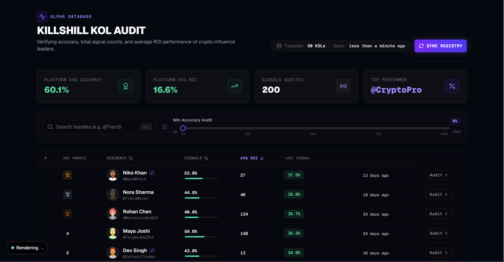
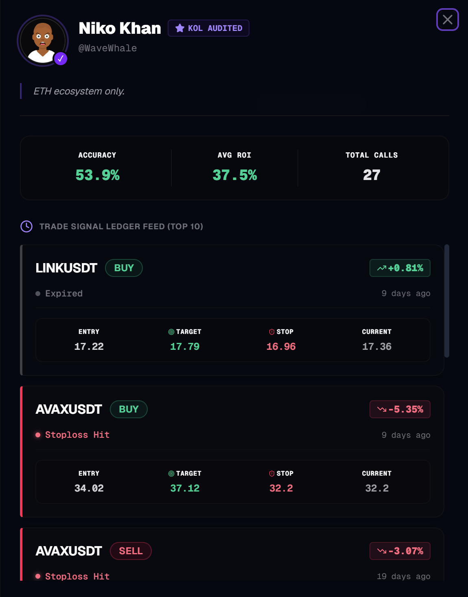
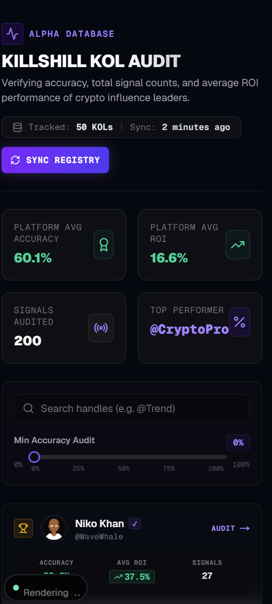

# Killshill KOL Audit Dashboard

A responsive KOL (Key Opinion Leader) analytics dashboard built as part of the **Killshill Frontend Internship Assignment**. The application helps visualize influencer performance through a sortable leaderboard, advanced filtering, and an interactive signal audit drawer, with a strong focus on clean architecture, accessibility, and responsive design.

## 🚀 Live Demo

**Live Application:** https://killshill.vercel.app/

## 📂 Repository

**GitHub:** https://github.com/Anish9686/Killshill

---

# ✨ Features

- 📊 Sortable KOL leaderboard
- 🔍 Search KOLs by handle
- 🎯 Minimum accuracy filter
- 📈 Sparkline ROI charts
- 📱 Dedicated mobile card layout
- 📂 Interactive signal detail drawer
- ⚡ Optimistic refresh experience
- 🔗 URL-synced filters and sorting
- ⌨️ Keyboard navigation support
- 🌙 Dark mode interface
- 💀 Skeleton loading states
- 📭 Empty state with clear filters
- ⚠️ Error state with retry option
- ♿ Accessibility-focused interactions

---

# 🛠 Tech Stack

| Category | Technology |
|----------|------------|
| Framework | Next.js 16 (App Router) |
| Library | React 19 |
| Language | TypeScript (Strict Mode) |
| Styling | Tailwind CSS v4 |
| UI Components | shadcn/ui + Radix UI |
| Table | TanStack Table v8 |
| State Management | Zustand |
| Charts | Recharts |
| Notifications | Sonner |
| Icons | Lucide React |
| Utilities | date-fns |

---

# 📁 Project Structure

```text
src/
├── app/
├── components/
│   ├── dashboard/
│   ├── leaderboard/
│   ├── drawer/
│   ├── filters/
│   ├── mobile/
│   └── shared/
├── hooks/
├── services/
├── store/
├── types/
├── lib/
└── constants/
```

The project follows a modular architecture that separates UI components, state management, API services, utilities, and reusable logic to keep the codebase organized and maintainable.

---

# 🏗 Architecture Highlights

### URL-Synced Filters

Filter and sorting state are synchronized with URL query parameters, making dashboard views bookmarkable and shareable.

Example:

```
?search=niko&minAccuracy=70&sortBy=avg_roi_pct&sortOrder=desc
```

---

### Optimistic Refresh

Refreshing the dashboard keeps existing data visible while fetching new data, providing a smoother user experience without unnecessary layout shifts.

---

### Zustand State Management

Global state is managed with Zustand for:

- Dashboard data
- Selected KOL
- Drawer state
- Refresh state
- Filter state

This keeps the application lightweight while avoiding unnecessary boilerplate.

---

### Responsive Design

Instead of collapsing the desktop table, the mobile experience uses dedicated cards optimized for smaller screens and touch interactions.

---

### Accessibility

The application includes:

- Keyboard navigation
- Visible focus indicators
- Semantic HTML
- Accessible buttons and inputs
- Drawer keyboard controls

---

# ⚖️ Technical Decisions

- Client-side filtering and sorting are used since the provided dataset is relatively small, ensuring fast interactions.
- Sparkline charts are rendered client-side to avoid hydration issues in Next.js.
- Optimistic refresh improves perceived performance by preserving existing content during data updates.

---

# 📱 Responsive Support

Designed and tested for:

- Desktop (1440px)
- Tablet (768px)
- Mobile (375px)

The mobile interface uses dedicated cards instead of compressing the desktop table.

---

# 📋 Assignment Checklist

- ✅ Header with title, total KOL count, timestamp, and refresh button
- ✅ Sortable leaderboard
- ✅ Search by handle
- ✅ Minimum accuracy filter
- ✅ Interactive signal detail drawer
- ✅ Loading state
- ✅ Empty state
- ✅ Error state
- ✅ Responsive mobile layout
- ✅ Dark theme
- ✅ Stretch Goals
  - URL-synced filters
  - Optimistic refresh
  - Sparkline ROI visualization
  - Keyboard navigation

---

# 📸 Screenshots

## Dashboard


## Signal Drawer


## Mobile View


---

# 🚀 Getting Started

## Install dependencies

```bash
npm install
```

## Run the development server

```bash
npm run dev
```

Open:

```
http://localhost:3000
```

## Build for production

```bash
npm run build
```

## Start production server

```bash
npm start
```

---

# 🌐 Deployment

The application is deployed using **Vercel**.

Deployment steps:

1. Connect the repository to Vercel.
2. Vercel automatically detects the Next.js project.
3. Build command:

```bash
npm run build
```

4. Deploy.

---

# 💭 What I Learned

This project helped strengthen my understanding of:

- Building data-heavy dashboards
- TanStack Table
- URL-based state management
- Responsive UI design
- Optimistic UI updates
- Zustand state management
- Accessibility best practices
- Component-based architecture

---

## 📄 License

This project was created solely for the **Killshill Frontend Internship Assignment** and is intended for evaluation purposes.
